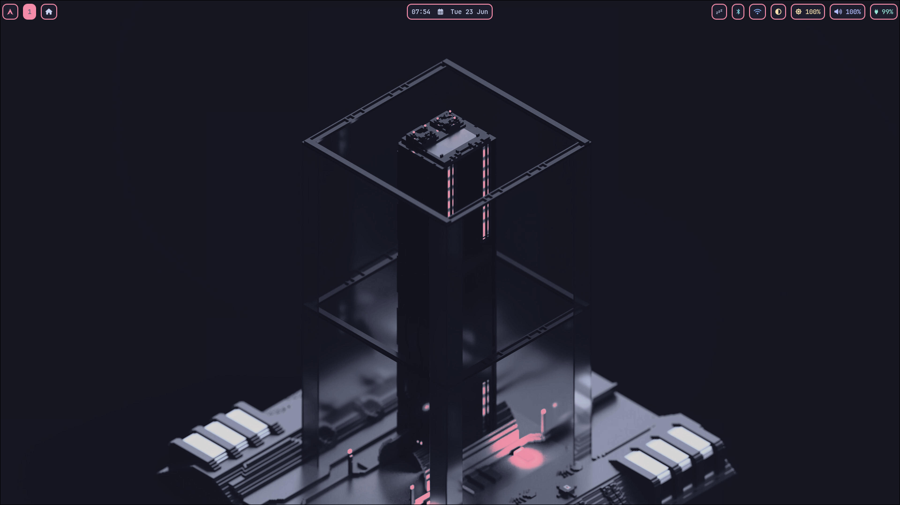
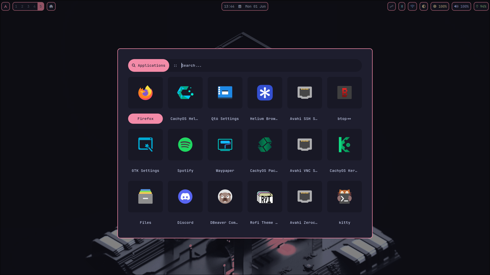
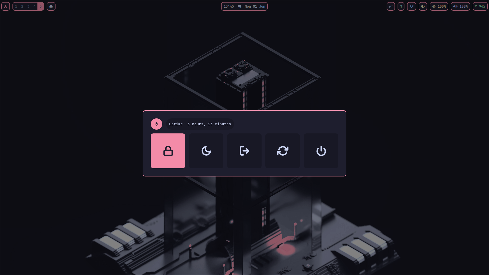
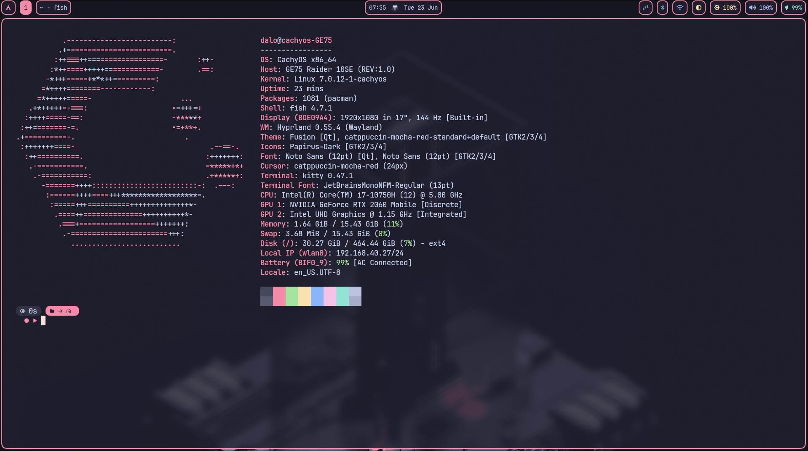
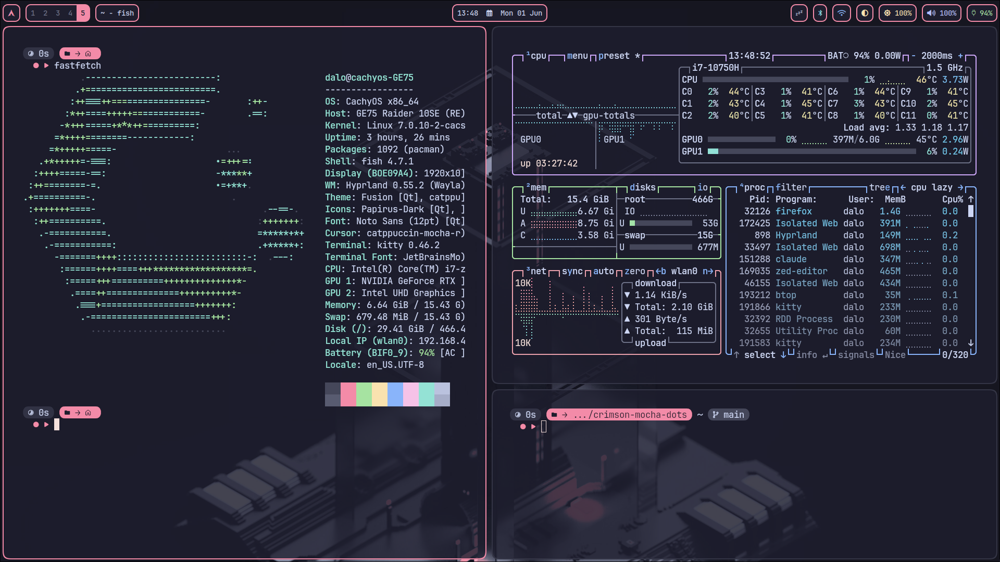
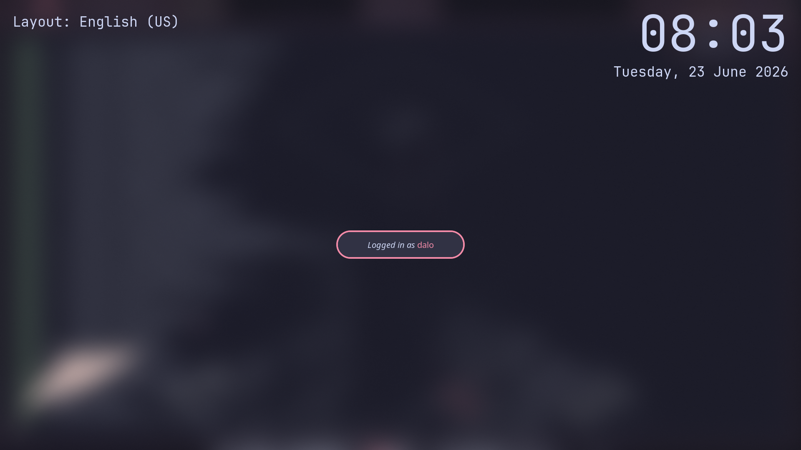

# Crimson Mocha Dotfiles

A personal dotfiles collection for a [CachyOS](https://cachyos.org) + [Hyprland](https://hyprland.org) desktop,
themed end to end with the [Catppuccin Mocha Red](https://github.com/catppuccin/catppuccin) palette.

Every component — bar, launcher, terminal, prompt, lockscreen and notifications — shares the same colors
for a cohesive look, and the Hyprland config is written entirely in **Lua** for a modular, readable setup.

<p>
  <a href="https://cachyos.org"></a>
  &nbsp;&nbsp;
  <a href="https://hyprland.org"></a>
  &nbsp;&nbsp;
  <a href="https://github.com/catppuccin/catppuccin"></a>
</p>

---

## Preview



| | |
|:---:|:---:|
|  |  |
| **Launcher** (`Super + Space`) | **Power menu** (`Super + Escape`) |
|  |  |
| **Kitty + Fastfetch** | **Tiled workspace** |

**Waybar**


**Lockscreen** (hyprlock)



---

## Keybindings

All binds live in [`.config/hypr/modules/binds.lua`](.config/hypr/modules/binds.lua).
`Super` is the main modifier.

<details>
<summary><b>Show keybindings</b></summary>

### Windows

| Keybind | Action |
|---------|--------|
| `Super + Q` | Close active window |
| `Super + V` | Toggle split direction |
| `Super + Shift + F` | Toggle fullscreen (maximized) |
| `Super + Shift + T` | Toggle floating |
| `Super + ←/→/↑/↓` | Move focus |
| `Super + Shift + ←/→/↑/↓` | Move window |
| `Super + Left/Right Mouse (drag)` | Move / resize window |

### Workspaces

| Keybind | Action |
|---------|--------|
| `Super + 1–0` | Switch to workspace 1–10 |
| `Super + Shift + 1–0` | Move window to workspace 1–10 |
| `Super + Scroll` | Cycle through workspaces |
| `Super + S` | Toggle scratchpad |
| `Super + Shift + S` | Move window to scratchpad |

### Launchers & menus

| Keybind | Action |
|---------|--------|
| `Super + Return` | Terminal (kitty) |
| `Super + B` | Browser (firefox) |
| `Super + F` | File manager (nemo) |
| `Super + M` | Music (spotify) |
| `Super + W` | Wallpaper picker (waypaper) |
| `Super + Space` | App launcher (rofi) |
| `Super + Escape` | Power menu |
| `Super + Shift + C` | Clipboard history |

### Screenshots

| Keybind | Action |
|---------|--------|
| `Print` | Region screenshot — save to `~/Pictures/Screenshots/` + copy |
| `Super + Print` | Region screenshot — open in swappy to annotate |

### Media & hardware keys

| Keybind | Action |
|---------|--------|
| `XF86Audio Raise/Lower/Mute` | Volume up / down / mute (`wpctl`) |
| `XF86AudioMicMute` | Toggle mic mute (`wpctl`) |
| `XF86MonBrightness Up/Down` | Screen brightness (`brightnessctl`) |
| `XF86Audio Next/Prev/Play` | Media controls (`playerctl`) |

</details>

---

## Installation

> [!NOTE]
> These steps assume a **clean install with no window manager** already set up.
> Everything here was done on an **Arch-based distro** ([CachyOS](https://cachyos.org)),
> so it should work on any other Arch-based system — just keep an eye out for
> package names that may differ or be missing on your distro.

The setup is broken down **part by part**, one tool at a time, so you can follow
along and only install the pieces you want.

### 1. Hyprland, terminal & display manager

Start with the compositor itself, a terminal to work from, and a display manager
to greet you at boot. The display manager is up to you — here we use **ly**, a
lightweight TUI greeter:

```bash
sudo pacman -S hyprland kitty ly
sudo systemctl enable ly@tty2.service
```

- [`hyprland`](https://github.com/hyprwm/Hyprland) — the Wayland compositor everything else runs on. Its config is written in **Lua** and split into modules under `.config/hypr/` (`hyprland.lua` is the entry point that loads them).
- [`kitty`](https://github.com/kovidgoyal/kitty) — GPU-accelerated terminal, themed with Catppuccin Mocha. Config lives in `.config/kitty/` (`kitty.conf` for font/opacity/padding, `current-theme.conf` for the color scheme).
- [`ly`](https://github.com/fairyglade/ly) — lightweight TUI display manager / login greeter; `ly@tty2.service` starts it on tty2.

> [!IMPORTANT]
> This config is written in **Lua** (`hyprland.lua`), which Hyprland only loads on
> builds compiled with Lua config support. Most up-to-date Arch packages include
> it, but if Hyprland ignores the Lua config and falls back to `hyprland.conf`,
> your build lacks it — check `hyprctl version` / your package's build flags.

Reboot (or start ly) and pick the **Hyprland** session to log in.

### 2. Essential Hyprland utilities

Unlike a full desktop environment, Hyprland doesn't ship these core services —
they have to be installed manually. These are the
[must-haves from the official wiki](https://wiki.hypr.land/Useful-Utilities/Must-have/):

```bash
sudo pacman -S hyprpolkitagent xdg-desktop-portal-hyprland xdg-desktop-portal-gtk qt5-wayland qt6-wayland mako
```

- [`hyprpolkitagent`](https://github.com/hyprwm/hyprpolkitagent) — Polkit authentication agent (privilege escalation prompts)
- [`xdg-desktop-portal-hyprland`](https://github.com/hyprwm/xdg-desktop-portal-hyprland) — desktop portal for screen sharing and file pickers
- [`xdg-desktop-portal-gtk`](https://github.com/flatpak/xdg-desktop-portal-gtk) — GTK fallback portal (file dialogs, settings)
- `qt5-wayland` / `qt6-wayland` — native Wayland support for Qt apps
- [`mako`](https://github.com/emersion/mako) — notification daemon (Hyprland ships none by default)

The repo ships a themed mako config at `.config/mako/config` — Catppuccin Mocha
Red colors, per-urgency border accents (low / normal / high) and a dedicated
`mpd` category for media notifications.

### 3. Sound & fonts

CachyOS normally installs the audio stack and base fonts out of the box, so you
can likely **skip this step**. If sound isn't working or glyphs are missing,
install them manually.

**Audio** — [PipeWire](https://pipewire.org) + [WirePlumber](https://pipewire.pages.freedesktop.org/wireplumber/):

```bash
sudo pacman -S pipewire pipewire-pulse wireplumber
```

**Fonts** — Noto Sans (regular, CJK and emoji) plus JetBrains Mono Nerd Font:

```bash
sudo pacman -S noto-fonts noto-fonts-cjk noto-fonts-emoji ttf-jetbrains-mono-nerd
```

> [!TIP]
> A few tools below live in the **AUR**. CachyOS ships with [`paru`](https://github.com/Morganamilo/paru)
> as its AUR helper, so those are installed with `paru -S` instead of `sudo pacman -S`.

### 4. Bar: Waybar

A top bar split into three zones:

- **Left** — a launcher group that reveals CPU, temperature, memory and disk on click, followed by Hyprland workspaces, the focused window title and an MPRIS player.
- **Center** — clock with a calendar tooltip.
- **Right** — system tray, idle inhibitor, Bluetooth, VPN + network, power profile, backlight, volume and battery.

```bash
sudo pacman -S waybar
```

Several modules shell out to other programs, so install these for them to work:

```bash
sudo pacman -S networkmanager power-profiles-daemon bluez bluez-utils pulsemixer
paru -S bluetuith
```

- `networkmanager` — `nmtui` (network module click) and `nmcli` (the network script). Enable it with `sudo systemctl enable --now NetworkManager`.
- `power-profiles-daemon` — backs the power-profile module.
- `bluez` / `bluez-utils` — Bluetooth stack (`sudo systemctl enable --now bluetooth`); `bluetuith` is the TUI opened when you click the Bluetooth module.
- `pulsemixer` — audio TUI opened from the volume module.

> The MPRIS module and media keys rely on `playerctl`, and the volume module on `wpctl` (WirePlumber) — both covered in step 11 / step 3.

Config lives in `.config/waybar/` (`config.jsonc`, `style.css`, `mocha.css`, `scripts/network.sh`).

### 5. Launcher & menus: Rofi

Three menus sharing one Catppuccin Mocha Red theme:

- **Launcher** (`Super + Space`) — app launcher (`drun`).
- **Power menu** (`Super + Escape`) — lock / suspend / logout / reboot / shutdown, each behind a confirm step.
- **Clipboard** (`Super + Shift + C`) — cliphist history picker.

```bash
paru -S rofi-wayland
```

The menu scripts are Bash; the power menu also calls `playerctl`, `wpctl` and
`hyprlock` (from later steps). Config lives in `.config/rofi/`.

### 6. Clipboard: wl-clipboard + cliphist

On Hyprland startup two `wl-paste --watch` daemons pipe copied text and images
into `cliphist`, building the history the rofi clipboard menu browses.

```bash
sudo pacman -S wl-clipboard cliphist
```

- [`wl-clipboard`](https://github.com/bugaevc/wl-clipboard) — `wl-copy` / `wl-paste`
- [`cliphist`](https://github.com/sentriz/cliphist) — clipboard history (browsed via the rofi clipboard menu)

The watchers are launched from `.config/hypr/modules/autostart.lua`.

### 7. Lockscreen & idle: hyprlock + hypridle

The lockscreen shows a clock, avatar and password field in the Mocha palette.
`hypridle` runs the timeout chain: dim → lock → screen off (dpms) → suspend, and
is started with Hyprland.

```bash
sudo pacman -S hyprlock hypridle
```

- [`hyprlock`](https://github.com/hyprwm/hyprlock) — lockscreen (config: `.config/hypr/hyprlock.conf`, palette in `mocha.conf`)
- [`hypridle`](https://github.com/hyprwm/hypridle) — idle daemon (config: `.config/hypr/hypridle.conf`)

### 8. Screenshots: grim + slurp + swappy

- `Print` — select a region, save it to `~/Pictures/Screenshots/`, copy it to the clipboard and toast a confirmation.
- `Super + Print` — select a region and open it straight in swappy to annotate.

```bash
sudo pacman -S grim slurp swappy
mkdir -p ~/Pictures/Screenshots
```

- [`grim`](https://sr.ht/~emersion/grim) — capture
- [`slurp`](https://github.com/emersion/slurp) — region selection
- [`swappy`](https://github.com/jtheoof/swappy) — annotate / edit

The confirmation toast uses `notify-send` (from `libnotify`, pulled in with
mako). Keybinds are defined in `.config/hypr/modules/binds.lua`.

### 9. Wallpaper: awww + waypaper

`awww-daemon` starts with Hyprland and renders the wallpaper; `waypaper`
(`Super + W`) is the picker GUI used to switch between the images in
`.config/wallpapers/`.

```bash
paru -S awww waypaper
```

- `awww` — wallpaper daemon (`awww-daemon`), launched from `autostart.lua`
- [`waypaper`](https://github.com/anufrievroman/waypaper) — wallpaper picker GUI

> The daemon binary is `awww-daemon` as set in `autostart.lua` — double-check the
> AUR package name on your system if it isn't found.

### 10. Media & hardware keys

The `XF86` media keys are bound in `binds.lua`: volume and mic mute go through
`wpctl` (WirePlumber, from step 3), brightness through `brightnessctl`, and
play/pause/next/prev through `playerctl` (which also feeds Waybar's MPRIS
module).

```bash
sudo pacman -S brightnessctl playerctl
```

- [`brightnessctl`](https://github.com/Hummer12007/brightnessctl) — screen brightness keys
- [`playerctl`](https://github.com/altdesktop/playerctl) — media key control + Waybar MPRIS

### 11. File manager, browser & music

These are the default apps wired to keybinds in `binds.lua`: `Super + F` opens
Nemo, `Super + B` Firefox and `Super + M` Spotify (which also shows up in the
Waybar / mako MPRIS displays with its own icon).

```bash
sudo pacman -S nemo firefox
paru -S spotify
```

- [`nemo`](https://github.com/linuxmint/nemo) — file manager
- [`firefox`](https://www.mozilla.org/firefox/) — browser
- [`spotify`](https://www.spotify.com) — music (AUR)

### 12. Theming (GTK / Qt / icons / cursor)

This is what makes GTK and Qt apps, the icon set, folder accents and the cursor
all match the Catppuccin Mocha Red look. Install the tools, then apply the
themes:

```bash
sudo pacman -S nwg-look qt6ct papirus-icon-theme
paru -S catppuccin-mocha-red-cursors
```

- [`nwg-look`](https://github.com/nwg-piotr/nwg-look) — GTK theme/icon/cursor settings on Wayland
- [`qt6ct`](https://github.com/trialuser02/qt6ct) — Qt theme configuration
- [`papirus-icon-theme`](https://github.com/PapirusDevelopmentTeam/papirus-icon-theme) — icons (folder accent via [catppuccin-papirus-folders](https://github.com/catppuccin/papirus-folders))
- [`catppuccin-mocha-red-cursors`](https://github.com/catppuccin/cursors) — Catppuccin Mocha Red cursor

The GTK and Qt Catppuccin Mocha themes are installed from the
[catppuccin/gtk](https://github.com/catppuccin/gtk) and
[catppuccin/qt5ct](https://github.com/catppuccin/qt5ct) repos, then selected in
nwg-look / qt6ct.

### 13. Deploy the configs

This repo has no install script yet — copy the configs into place manually:

```bash
git clone https://github.com/<your-user>/crimson-mocha-dots.git
cp -r crimson-mocha-dots/.config/* ~/.config/
```

Log out and back into the Hyprland session to load everything.

---

## License

Released under the [MIT License](LICENSE) — feel free to copy, tweak and reuse any of it.
